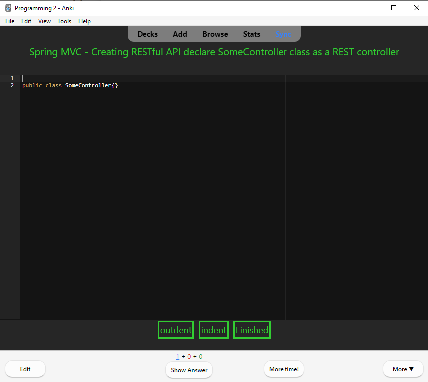
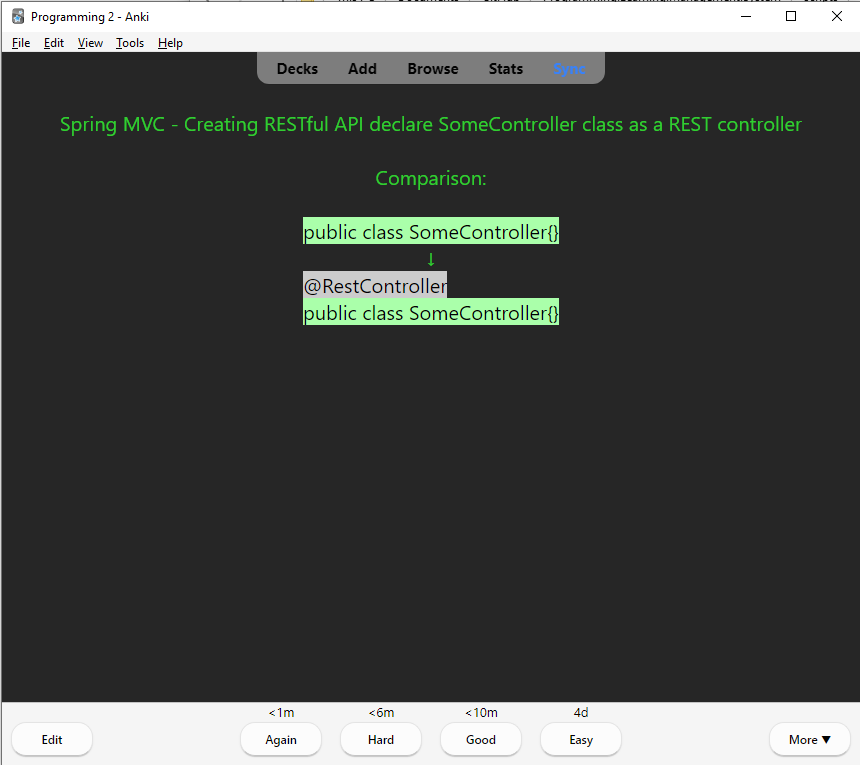
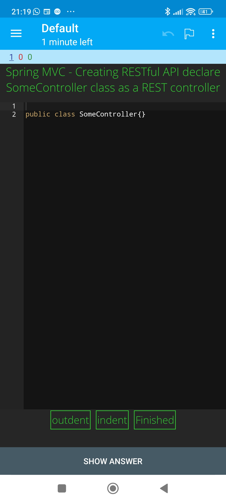
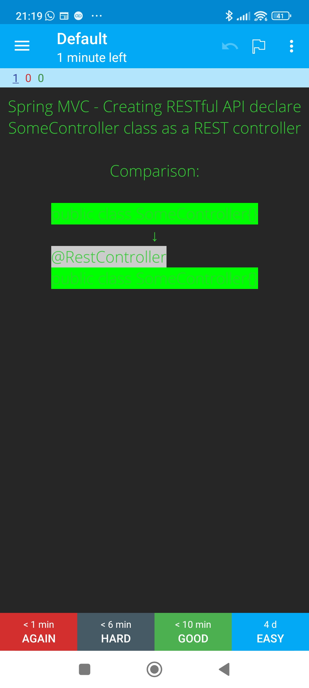

# Anki Programming Note Template 1

# Note type Fields
- Instructions
- StartingCode
- ExpectedCode

# How to use
- Add cards with `Instructions` a `StartingCode` that you must complete and a `ExpectedCode`
- When reviewing cards, instead of pressing Anki "Show answer" press **Finished** button to move to next screen and see a comparison

# Implementation
- Embedded code editor: [Ace Code](https://ace.c9.io/)
- Store typed code for answer screen: [Anki persist](https://github.com/SimonLammer/anki-persistence)
- Difference between `typed code` and `Expected Code` implemented on client-side using: [diff-match-patch](https://github.com/google/diff-match-patch)

# Files:
- front-template.html
- back-template.html
- style.css

# Tested on
- Anki Desktop: 2.1.58
- Ankidroid: 2.15.6

# Roadmap
- [ ] Support `StartCode` written in HTML
- [ ] Adjust styling

# Examples

